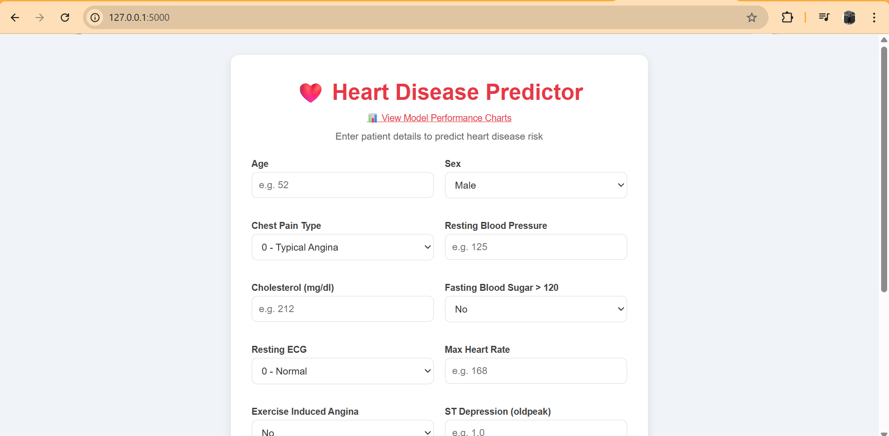
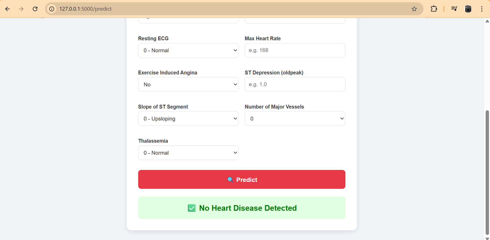
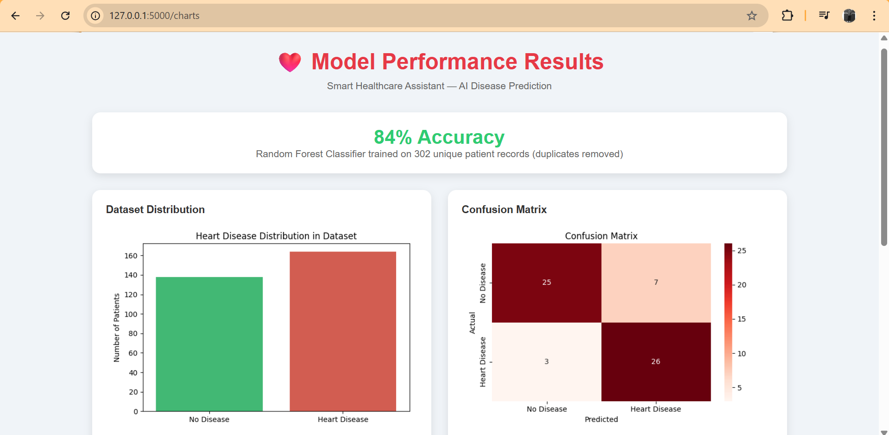
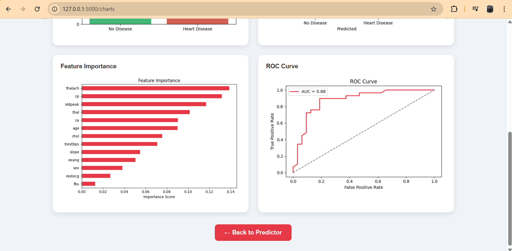

# Smart Healthcare Assistant

Live demo: https://smart-healthcare-assistant-vszt.onrender.com

A web app that predicts heart disease risk from patient clinical data. Built with Python and Flask as a personal project during my MSc AI studies at BTU Cottbus.


---

## Why I built this

During my first semester at BTU, I wanted to apply what I was learning in class to a real problem. Healthcare prediction felt like a good fit — the data is publicly available, the problem is meaningful, and it covers the full ML pipeline from raw data to a working interface.

---

## What it does

You enter a patient's clinical details (age, blood pressure, cholesterol, etc.) and the app predicts whether they are at risk of heart disease. Results are shown instantly with a simple risk indicator (low / high).

There is also a separate page showing how the model performs — confusion matrix, feature importance, ROC curve, and dataset distribution.

---

## Data note

The Kaggle version of this dataset has 1025 rows but only 302 are unique. I removed the duplicates before training to avoid inflated accuracy scores. Without deduplication the model scores 99%, which looks impressive but is misleading. After cleaning, accuracy is 84% which is honest and consistent with published research on this dataset.

---

## Model results

| Metric | Score |
|--------|-------|
| Train / Test Split | 80% / 20% |
| Test Accuracy | 83.61% |
| 5-Fold Cross Validation | 82.78% ± 4.02% |
| Precision | 84% |
| Recall | 84% |
| F1-Score | 84% |
| ROC-AUC | 0.879 |

Evaluation performed on a held-out test set and validated using 5-fold cross-validation. Trained both Random Forest and XGBoost. Random Forest performed slightly better and was saved as the final model.

---

## Tech used

- Python, Flask
- Scikit-Learn, XGBoost
- Pandas, NumPy
- Matplotlib, Seaborn
- HTML, CSS

---

## Project structure

```
Smart-Healthcare-Assistant/
├── templates/
│   ├── index.html        
│   └── charts.html       
├── static/
│   ├── confusion_matrix.png
│   ├── distribution.png
│   ├── feature_importance.png
│   └── roc_curve.png
├── screenshots/
│   ├── home1.png
│   ├── home2.png
│   ├── charts1.png
│   └── charts2.png
├── app.py               
├── model.py             
├── charts.py            
├── explore.py           
├── heart.csv            
├── requirements.txt     
└── README.md
```

---

## How to run

```bash
git clone https://github.com/MettuSurendraReddy/Smart-Healthcare-Assistant.git
cd Smart-Healthcare-Assistant
pip install -r requirements.txt
python model.py
python charts.py
python app.py
```

Then open `http://127.0.0.1:5000` in your browser.

---

## Screenshots

### Prediction Page



### Model Performance



---

## Dataset

UCI Heart Disease dataset (Kaggle version)  
302 unique records after removing duplicates  
13 input features, 1 binary target (heart disease yes/no)

---

## Disclaimer

This project is for educational purposes only and should not be used for medical diagnosis.

---

## What I learned

- How duplicate data silently inflates model accuracy and why deduplication matters before training
- The difference between training accuracy and cross-validated accuracy
- How to build an end-to-end ML pipeline from raw data to a working web application
- Why 84% honest accuracy is better than 99% misleading accuracy
- How to use Flask to serve ML model predictions via a web interface

---

## About me

I am currently doing my MSc in Artificial Intelligence at Brandenburg University of Technology (BTU Cottbus) and looking for an internship in machine learning or data science.

[LinkedIn](https://www.linkedin.com/in/-surendrareddy) | [GitHub](https://github.com/MettuSurendraReddy) | surendrareddy.mettu25@gmail.com